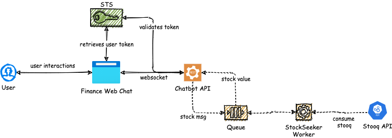
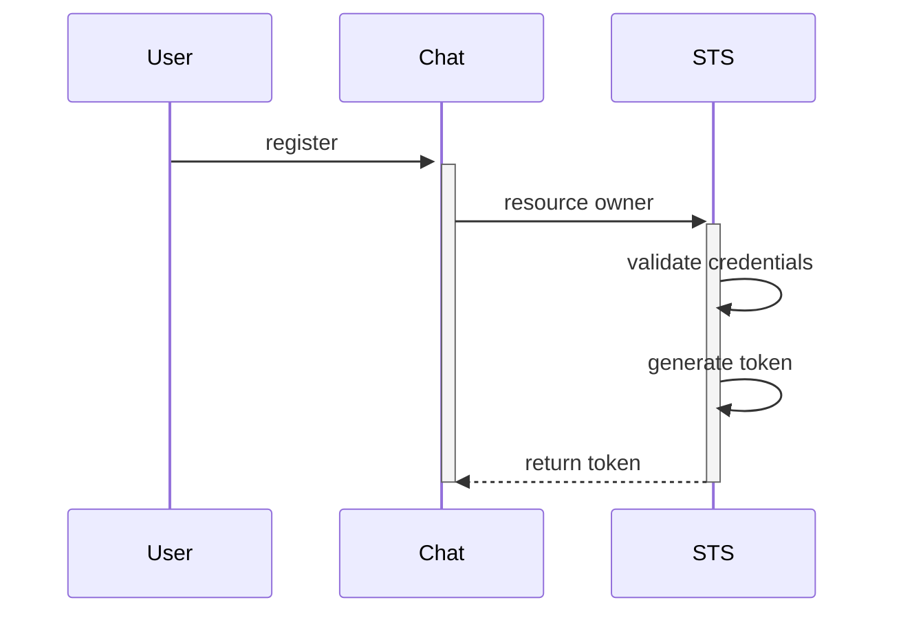
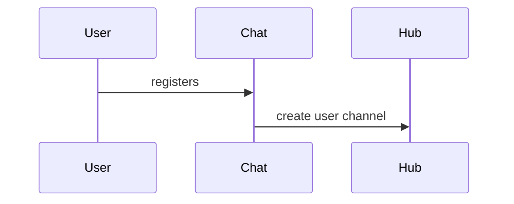

# Finance Chatbot

## Solution Overview



## Data Flow

### 1. User AuthN & AuthZ



### 2. Chat flow



## Deploy instructions

The project was structured using containers for the chatbot application and the backing service, on this case RabbitMQ.
Run the following command to get the project up and running:

```shell
docker-compose up -d
```

## TODO List

[ ] Implement OAuth 2.0 flow
[ ] Improve front end
